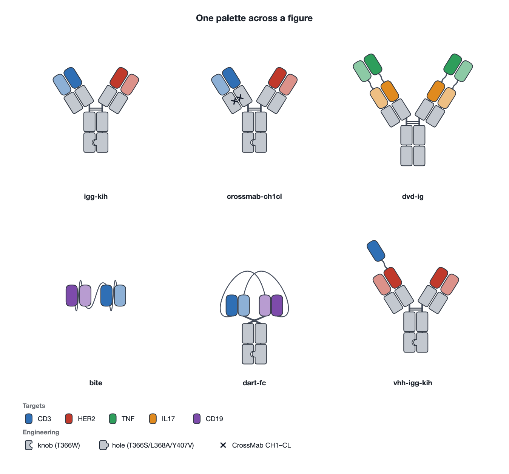
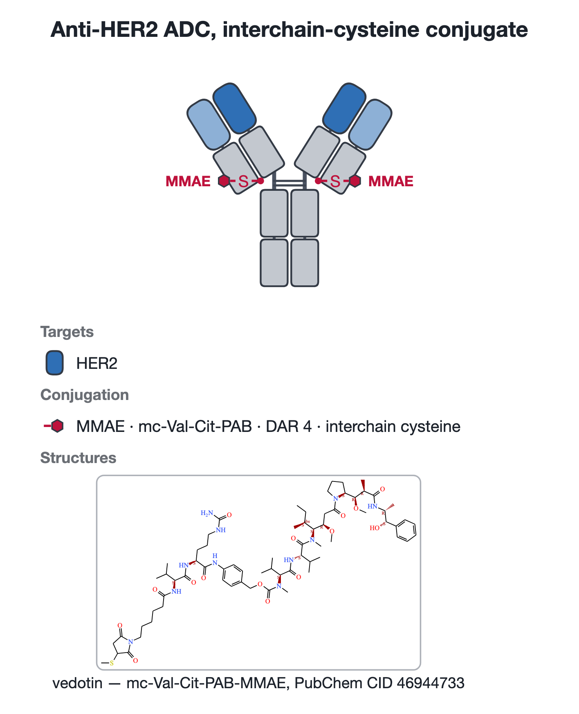
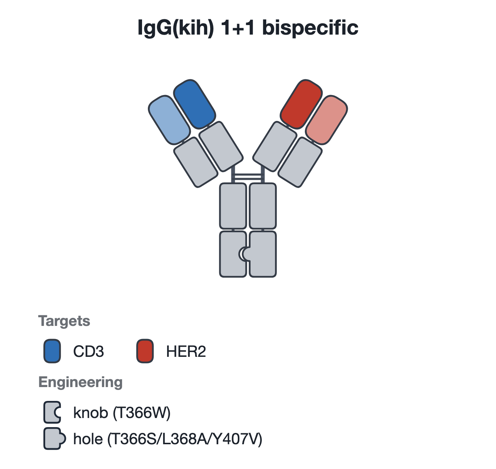
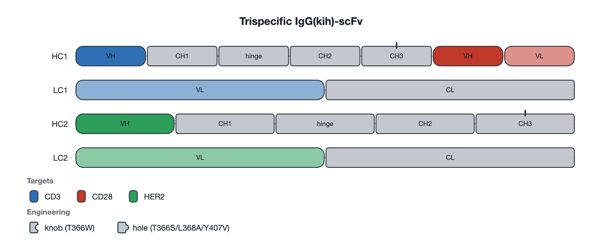
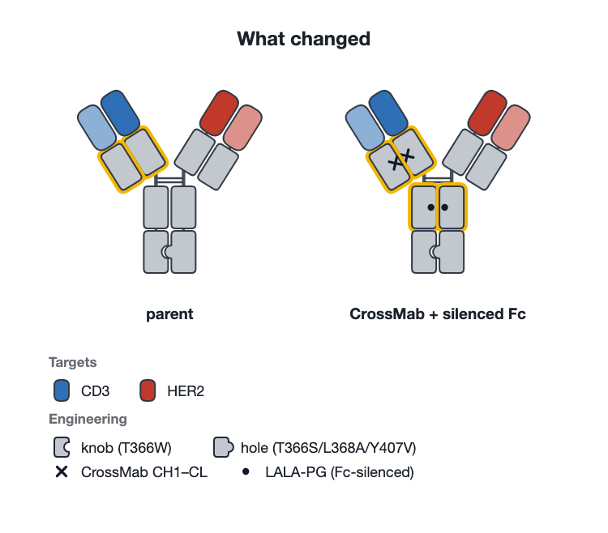

# DENEB リファレンス（日本語）

[概要に戻る](../README.ja.md) · [English reference](reference.md)

**D**rawing **E**ngine for **N**otated, **E**ngineered **B**iologics — 抗体フォーマットを
SVG の模式図として描くライブラリです。フロントエンドにそのまま組み込めます。
英語版の詳細は [reference.md](reference.md) を参照してください。

## これは何をするものか

鎖とドメインの構成を渡すと、Fc を軸にした Y 字、タンデム scFv、ダイアボディ、
付加ドメイン型 IgG、非 Ig 融合などを描き分けます。可変ドメインは**標的ごとに
色分け**されるので、バイスペシフィック／マルチスペシフィックが一目で判別できます。

エンジニアリング要素は「あるべき位置」に描かれます。knob-into-hole は CH3 の
輪郭そのものに彫り込まれ、Fc サイレンシング変異はパートナー側の界面エッジに、
糖鎖や **ADC のペイロード**は溶媒側のエッジから突き出します。描いたものは
すべて凡例に自動でまとまります。

**このライブラリはアノテーションを描くだけで、アノテーション自体は作りません。**
配列からのドメイン認識（HMM / 機械学習）は別途用意し、その出力を渡してください。



- ランタイム依存ゼロ。コアはフレームワーク非依存で SVG 文字列を返すため、
  Node 上でも動きます（SSR・静的書き出し・スナップショットテスト）。
- React コンポーネント（`deneb/react`）は**同じ Scene** を React 要素
  として描くので、`onClick` / `onMouseEnter` がドメインの `<g>` に直接届きます。
  ただし、信頼済みの `payload.structure.svg` を直接埋め込む場合だけは例外です。
  ユーザ入力由来の構造式には `href` を使用してください。
- 主要なバイスペシフィック・フラグメント・ADC フォーマット 49 種をプリセットとして同梱。

## インストール

```sh
npm install deneb
```

`react` と `react-dom` は任意の peer dependency です。`deneb/react` を使う場合だけ
必要です。

## 使い方

```ts
import { renderSVG, parseDSL, type Construct } from 'deneb';

// 正式な入力は構造化 JSON（HMM/ML パイプラインの出力をそのまま入れられます）
const spec: Construct = {
  name: 'IgG(kih) 1+1 bispecific',
  chains: [
    {
      id: 'HC1',
      domains: [
        { type: 'VH', start: 1, end: 120, specificity: 'CD3' },
        { type: 'CH1', start: 121, end: 218 },
        { type: 'hinge', start: 219, end: 233 },
        { type: 'CH2', start: 234, end: 341, modifications: [{ type: 'lala' }] },
        { type: 'CH3', start: 342, end: 447, modifications: [{ type: 'knob' }] },
      ],
    },
    { id: 'LC1', domains: [{ type: 'VL', specificity: 'CD3' }, { type: 'CL' }] },
    {
      id: 'HC2',
      domains: [
        { type: 'VH', specificity: 'HER2' },
        { type: 'CH1' },
        { type: 'hinge' },
        { type: 'CH2', modifications: [{ type: 'lala' }] },
        { type: 'CH3', modifications: [{ type: 'hole' }] },
      ],
    },
    { id: 'LC2', domains: [{ type: 'VL', specificity: 'HER2' }, { type: 'CL' }] },
  ],
};

const { svg, layout } = renderSVG(spec);

// 手で書く・目視確認する用のコンパクトな記法もあります
renderSVG(parseDSL(`
  @name IgG(kih) 1+1 bispecific
  HC1: VH(CD3)-CH1-h-CH2[lala]-CH3[knob]
  LC1: VL(CD3)-CL
  HC2: VH(HER2)-CH1-h-CH2[lala]-CH3[hole]
  LC2: VL(HER2)-CL
`));
```

React では:

```tsx
import { AntibodyViewer } from 'deneb/react';

<AntibodyViewer
  construct={spec}
  highlight={['spec:CD3']}
  onDomainClick={(info) => console.log(info.domain.id, info.domain.start, info.domain.end)}
  renderTooltip={(info) => <>{info.domain.label}</>}
/>
```

## 記法（DSL）

| 記号 | 意味 |
| --- | --- |
| `ID:` | 鎖のラベル（省略すると `C1`, `C2`, …） |
| `-` | ドメインを直接連結 |
| `~` | リンカーを挟んで連結（`VH(A)~VL(A)` が scFv） |
| `(標的)` | このドメインが結合に寄与する標的。色を決める |
| `[改変, 改変=残基/残基]` | エンジニアリング改変（残基は省略可） |
| `[drug=化合物/リンカー/DAR/個数/部位]` | コンジュゲートしたペイロード（下記） |
| `*n` | 同一鎖が n 本ある（対称ホモダイマー） |
| `#` / `;` | 行コメント / 行区切り |

ディレクティブ: `@name` `@color 標的=#rrggbb` `@skeleton y|row` `@arm 角度`
`@armmode splayed|crossed` `@pair A:0 B:2` `@ss A:2 B:0`

### どのドメイン同士が対合するかを指定する

対合は 4 段の推論で決まり（後述）、通常のフォーマットはこれで正しく出ます。
`@pair` は推論では決められない場合のためのものです。TandAb の 4 組の交差ペアや、
交差そのものがフォーマットの本質である CODV-Ig がこれにあたります。

```
HC: VH(TNF)~VH(IL17)-CH1-h-CH2-CH3 *2
LC: VL(IL17)~VL(TNF)-CL *2
@pair HC:0 LC:2      # TNF は交差して対合する
@pair HC:2 LC:0      # IL17 も同様
```

ドメインの参照方法は 3 通りです。

| 参照 | 意味 |
| --- | --- |
| `HC:0` | その鎖の先頭ドメイン（リンカーやヒンジも数える） |
| `HC:CH3` | その鎖の CH3。**その型がちょうど 1 つのときだけ** |
| ドメインの `id` | JSON 入力で自分で付けた場合 |

同じ型が複数ある鎖に `HC:CH3` を使うと `ambiguous-link-ref` として警告し、先頭が
使われます。インデックスで書いてください。`*n` を付けた鎖に張ったリンクは全コピーに
複製されるので、対称に書いた分子は対称のまま描かれます。自然界にない組み合わせも
`@pair` すれば描きます（`implausible-pair` の警告付き）。

**並べて描けなかった対合には破線の接触線が引かれます。**（上の交差ペアがこれ）
隣り合って描かれた対合は位置がそれを示しているので、線は引きません。

## 自動推定されること

`normalize()` はレイアウトに必要な情報を補完し、**例外を投げません**。曖昧な点や
不正な点は `diagnostics` として返り、それでも図は描かれます。機械生成の入力が
不完全でも UI が落ちないようにするためです。

- **重鎖／軽鎖の判定** — Fc かヒンジを持つ鎖が重鎖。重鎖が 1 本でもあれば、Fab の
  定常ドメインを持つ他の鎖は軽鎖。これにより CH1 を持つ CrossMab の軽鎖を重鎖と
  誤判定しません。
- **ペアリング** — 明示 `links` → 鎖内 Fv（リンカー隣接かつ標的一致。標的一致を
  条件にすることでダイアボディを scFv と誤認しません）→ 標的一致による鎖間ペア
  → 重鎖／軽鎖の位置順マッチ（型ではなく位置なので CrossMab の入れ替えが保たれる）
  → CH2/CH3/CH4 の二量体化、の順。3 番目に注意してください。CODV-Ig から標的名を
  外すと、交差する手掛かりが消えて DVD-Ig になります。`@pair` で明示できます。
- **余ったドメイン** — 相手のいない可変／定常ドメインは報告されます
  （`unpaired-variable-domain` / `unpaired-constant-domain`）。VHH なら正常ですが、
  CH1 なら大抵は誤りです。Fc を持つ鎖が 3 本以上あると `fc-multimer-not-drawn` が
  出ます。最初の 1 組しか二量体化しません — IgM や IgA の多量体には J 鎖が必要で、
  このモデルはそれを表現する語彙を持ちません。
- **コピー** — `copies: 2`（`*2`）は実際の鎖に展開。共通軽鎖は重鎖の本数だけ複製。
- **骨格** — Fc か Fab 定常ドメインがあれば `y`、なければ `row`。可変ドメインが
  鎖をまたいで交差ペアを作る場合（DART など）はアームが `crossed` になります。

## 描画スタイル

すべてのドメインは同じ角丸の箱で、縦横比はおよそ 3:2 — Ig フォールドの実際の
プロポーションに近い値です。可変ドメインと定常ドメインは**輪郭の形ではなく色と
角の丸みで**区別されるため、混在した鎖が一本のつながりとして読めます。既定では
箱の中に文字を書きません（`showLabels: true` で `VH` / `CH1` などを表示できます。
傾いたアーム上でも文字は常に正立します。linear ビューは幅があるので常にラベル
付きです）。

**すべてのドメインは N 末端を上にして描かれます。** したがってリンカーは必ず
片方の C 末端面から出て、次のドメインの N 末端面に入ります（出た端に戻ることは
ありません）。single-chain Fv の VH と VL は、Fv が実際にパッキングするとおり
**水平に並べたまま**です。天然にペアを組む VH/VL より少しだけ間隔を広げてあり、
その隙間をリンカーが通ります。どちらが左でどちらが右かが `VH~VL` と `VL~VH` を
別の絵にしており、AbML が scFv を N→C の順で命名して区別しているのと同じ情報です。

リンカーは単に描くのではなく**経路を探索**します。水平に並んだ 2 つを繋ぐ鎖は
下向きに出て下向きに入る必要があるため 3 次ベジエになり、経路は狭いものから順に
試されます — まずペアの間の隙間を上る経路、間に何かある場合は下へ逃がしてから
上を越える弧。ダイアボディの交差した鎖がモジュールの上を弧で越えるのはこのため
です。交差は許容し、他の鎖と重なって走ることと、**自分自身を含む**グリフの上を
横切ることは許容しません — 全プリセットについてテストで検証しています。

各 Fab アームは**ヒンジへ続くドメインを基準に配置**されるため、ヒンジは常に
Fc と同じレーン上の短い垂直な線になります。重鎖が CH1 ではなく CL を持つ
CrossMab でも同様です。C 末端融合も、出てくる CH3 の**角ではなく底面**から
まっすぐ下りるように配置され、軽鎖が持つ C 末端融合は Fab と Fc の間に挟まる
のではなく枝として外へ出ます。

可変ドメインの N 末端と C 末端はどちらもパラトープと反対側の端にあります。
そのため single-chain Fv のリンカーは、片方のドメインの根元からもう片方の根元へ
ヘッドの下をくぐる形で描かれます。**`VH~VL` と `VL~VH` が別の絵になる**のは
このためです。向きを完全に明示したい場合は `showTermini: true` で各鎖の遊離末端に
N / C ラベルを表示できます。

## コンジュゲート（ADC など）

ADC のペイロードは名前を書くだけでなく**図として描かれます**。`drug` 改変に
`payload` を与えると、ドメインから化学リンカーを表すステムが伸び、その先に
化合物のグリフと名前が描かれ、リンカー・DAR・コンジュゲーション部位は凡例の
`Conjugation` セクションにまとまります。



リンカーがぶら下がっている**硫黄そのもの**が結合線上に描かれ、リンカーは
抽象的な記号ではなく実際の化学構造として描かれます。

```ts
{
  type: 'CH2',
  modifications: [{
    type: 'drug',
    payload: {
      name: 'MMAE',
      linker: 'mc-vc-PAB',
      dar: 4,                      // 角括弧の n = 4 と凡例に表示
      count: 2,                    // このドメインに描くグリフ数
      site: 'interchain cysteine',
      attachment: 'S',             // 結合上に書く原子。site から自動推定
      cleavable: true,             // false なら結合を破線で描く
      shape: 'hexagon',            // circle | triangle | diamond | square | star
    },
  }],
}
```

コンジュゲーションは ADC のスキームの書き方に合わせて描かれます — ドメイン表面
から伸びる結合、その化学が残す原子（システインのチオールなら `S`、リジンの
アミドなら `NH`、糖鎖やクリック反応なら `N`。`attachment` を指定しなければ
`site` から推定）、そしてリンカーとペイロード。`dar` を与えると角括弧で囲んで
`n = DAR` を添えます。

構造式を渡す場合は、**コンジュゲート後の形**（マレイミドが開いたチオスクシン
イミド、NHS が外れたリジンアミドなど）で描き、`attach` にその結合を担う原子を
指定してください。抗体からの結合線が箱の縁ではなく**その原子そのもの**に着地し、
「ペイロードが付いている」ではなく「**リンカーのどこに**付いているか」が図から
読み取れます。この場合、描画自体が原子と結合を示しているので `attachment` の
ラベルは重複を避けて省かれます。

さらに隣の原子を `attachFrom` で指定すると、**その結合が抗体からの結合線の
まっすぐな続きになるように描画が回転します**。指定しないと、分子は作図ツールが
たまたま採った角度のまま抗体から生えるので、リンカーと化合物が一続きの鎖として
読めなくなります。回転中も原子ラベルは正立に保たれます。回転は `mirror` に優先
します — 回転は真の合同変換なので、反転と違って立体化学もラベルの読み順も
壊しません。

化合物はそれがぶら下がるドメインよりずっと大きいので、外向きの面から出すだけでは
足りません。傾いた Fab アームでは、それでも描画が抗体に重なります。そこで
**結合線の方を譲ります** — コンジュゲーションの反応式が化合物を横に置くのと同じ
ように、描画がどのグリフとも重ならなくなるまで結合線を長く引きます。必要な分だけ
伸ばすので、Fc の下なら短いまま、CH1 なら長くなります。どちら側に出すかは
「分子の本体から遠い側」で、Fab の CH1 では「CL から遠い側」とは一致しません。

模式図では化学構造は一度書けば足りるので、インライン構造は**1 箇所だけ**
描かれます（`attach` を指定していれば、分子が抗体と反対側へ伸びる部位が
選ばれます）。残りの部位はペイロードのグリフで示されます。全部位に描くには
`repeatStructures: true` を指定してください。グリフを持たないドメインもこの選択に
参加します — interchain cysteine の ADC が結合するのはヒンジで、ヒンジは
コネクタとして描かれるためです。構造式は既定では反転しません。`attachFrom` を
与えず、かつ反対側のコピーを反転してよい場合だけ `structure.mirror: true` を
指定してください。

記法では化合物名を先頭に:

```
LC: VL(HER2)-CL[drug=MMAE/vc-PAB/4/2/interchain cysteine]
```

部位特異的コンジュゲーションは 2 つのマークで表せます — 導入したシステインが
`thiomab`、そこに付けたものが `drug` です。`showPayloadNames: false` で
グリフを残したまま名前だけ落とせます。

### 化合物の構造式

SMILES から構造を描くにはケミストリのツールキットが必要で、本ライブラリは
意図的にそれを抱えていません。**普段お使いのツール（RDKit・OpenChemLib・
Ketcher・ChemDraw など）で描画を生成し、その結果を渡してください。**

```ts
payload: {
  name: 'MMAE',
  structure: {
    href: 'data:image/svg+xml;base64,…',  // または svg: '<g>…</g>' で直接マークアップ
    viewBox: '0 0 300 200',               // 渡す描画自身の座標系
    width: 96, height: 58,                // 図中での描画サイズ
    attach: { x: 300, y: 100 },           // 結合する原子（viewBox 座標）
    caption: 'MMAE (auristatin)',         // 省略時はペイロード名
  },
}
```

`showStructures` で表示位置を選べます。`'legend'`（既定）は凡例の下に枠付き
サムネイルとキャプションを並べ、`'inline'` は**コンジュゲーション部位に構造を
直接結合**させてペイロードグリフの代わりに描き、`'none'` は無視します。

`'inline'` では、`attach`（結合する原子の位置）がドメインから伸びる結合線の
先端にちょうど乗るように配置され、`attachFrom` があればその結合の向きに合わせて
回転します。`viewBox` がある場合は同じ座標系で指定し、ない場合は描画枠に対する
比率で指定します。ドメインがどれだけ傾いていても構造は正立し、収まるよう viewBox
が広がります。**描画は余白を詰めて渡してください** — viewBox に大きな余白がある
と、結合線が分子ではなく空白に接続します。

#### 作図を用意する — `deneb/chem`

`attach` と `attachFrom` を手で正しく求めるには描画から原子座標を読む必要が
あるので、それを行う入口を用意しています。

```ts
import { Molecule } from 'openchemlib';
import { structureFromMolecule } from 'deneb/chem';

payload.structure = structureFromMolecule(
  // 抗体が結合する原子から始まる SMILES を、コンジュゲート後の形で
  //（マレイミドはすでにチオールで開いている）
  Molecule.fromSmiles('SC2CC(=O)N(CCCCCC(=O)N…)C2=O'),
  { attachAtom: 0, caption: 'mc-Val-Cit-PAB' },
);
```

`size` は描画の**長辺**（既定 150 図単位）です。もう一方は分子の形から決まるので、
たまたま縦長に描かれた化合物が抗体の倍の高さになることはありません。

分子**の座標そのもの**を回して、結合する原子が抗体を向くようにしてから描画します。
描画時ではなくここで回すことで、ツールキットが最終的な角度に合わせて原子ラベルを
正立に配置してくれます。そのうえで余白を切り詰め、両原子の位置を描画から直接
読み取ります。

ツールキットは **import ではなく引数で渡します**。依存が増えず、OpenChemLib の
特定バージョンにも縛られません。`DepictableMolecule` が必要なメソッドの一覧で、
SVG 出力に原子の目印を残すツールキットならどれでも使えます。

`svg` に渡したマークアップは**サニタイズせずそのまま**埋め込まれます。信頼できる
マークアップのみ渡してください。ユーザ入力由来のものは `href` の方が安全です。

## 可視化できる改変




| 分類 | 種類 |
| --- | --- |
| ヘテロ二量体化 | `knob` `hole` `charge+` `charge-` `duobody` `seed` `ew-rvt` `ha-tf` |
| 鎖のミスペア防止 | `crossmab-fab` `crossmab-ch1cl` `crossmab-vhvl` `orthogonal-fab` `disulfide` |
| エフェクター機能 | `lala` `lala-pg` `s228p` `glycan` `afucosyl` `aglycosyl` `adcc-enhanced` |
| 半減期 | `yte` `ls` |
| コンジュゲーション | `drug` `thiomab` `peg` `tag` |

`kih` `n297` `de` `adc` `his-tag` `igg4` などの略記もエイリアスとして受け付けます。
未知の名前は `{ type: 'custom', label }` として保持され、エラーにはなりません。

## ビュー

3 通りの描き方があります。既定は模式図ですが、Y 字を目で追えないほど
ドメインが増えた構造では、鎖ごとに軌道として並べる linear ビューが読めます。



| 関数 | コンポーネント | 内容 |
| --- | --- | --- |
| `renderSVG` | `<AntibodyViewer>` | 模式図 |
| `renderLinear` | `<AntibodyLinear>` | 鎖ごとのドメイン軌道図 |
| `renderLegend` | `<AntibodyLegend>` | 凡例のみ |

`renderLinear` はドメインが `start`/`end` を持っていれば残基スケールで描画し、
`positions` を与えると変異位置に目盛りを立てます。変異が配列上のどこにあるかを
正確に見せたいときはこちらを使ってください。

## インタラクションと書き出し

各ドメインは `data-domain-id` / `data-chain-id` / `data-domain-type` /
`data-specificity` / `data-start` / `data-end` を持つ `<g>` です。マーカーには
`data-modification-type` が付きます。`highlight` には `'HC1:CH3'`、`'chain:LC1'`、
`'spec:CD3'`、`'mod:knob'`、生のドメイン ID が使えるので、配列ビューアとの連動に
向いています。

書き出しは `downloadSVG(svg)` / `downloadPNG(svg, name, { scale })`（ブラウザ用）、
`svgToPngDataUrl(svg)`（データ URL を自分で扱う場合）。

## ビューア以外の機能

描画から先はすべて**独立したサブパス**に置いてあるので、図を描くだけのページが
それらを読み込むことはありません。コアは gzip 26 kB で、プリセット・lint・diff・
importer・AbML／VERITAS アダプタのいずれにも到達しません（ソースは
`tests/boundaries.test.ts`、ビルド成果物は `npm run size` で検証しています）。

| import | gzip | 内容 |
| --- | --- | --- |
| `deneb` | 26 kB | モデル・記法・レイアウト・描画 |
| `deneb/react` | 30 kB | コンポーネント |
| `deneb/presets` | 11 kB | 同梱 49 フォーマット |
| `deneb/lint` | 11 kB | 設計チェック |
| `deneb/diff` | 10 kB | 親／変異体の比較 |
| `deneb/panel` | 29 kB | 複数分子の図版 |
| `deneb/import` | 3 kB | ANARCI / IgBLAST アダプタ |
| `deneb/abml` | 13 kB | AbML 記法の読み書き |
| `deneb/veritas` | 13 kB | VERITAS フォーマット名の読み書き |

### 設計チェック（lint）

```ts
import { lint } from 'deneb/lint';

for (const f of lint(construct)) console.log(f.level, f.rule, f.message, f.hint);
```

描画ではなく**設計**のチェックです — 軽鎖が 2 種あるのにミスペアを防ぐ仕掛けがない、
knob に対応する hole がない、CD3 エンゲージャーなのに Fc がサイレンス化されていない、
IgG4 のヒンジが安定化されていない、DAR が 0 以下または組み込みの確認範囲 0–8 を
超えている、など。各 finding は図の `highlight` にそのまま渡せる `refs` を持つので、
指摘箇所をそのまま光らせられます。

命名や一般的な確認範囲を前提にするルールは `LINT_RULES` で `heuristic` と印が
ついており、個別に無効化できます。

```ts
lint(construct, { disable: ['effector-active-engager', 'dar-out-of-range'] });
```

重大度も同様に上書きできます。

### 親と変異体の比較




```ts
import { renderComparison } from 'deneb/panel';

const { svg, changes } = renderComparison(parent, variant, { labels: ['親', 'v2'] });
```

鎖はまず id、次に構成で対応づけるので、鎖名を変えただけで「置き換わった」とは
判定しません。配列は長さが同じときだけ残基ごとに比較します。長さが違う場合は
長さの変化だけを報告します — アライメントを推測すると、存在しない変異を
作り出してしまうためです。

### 複数分子の図版

このページ冒頭のパネルがこれです。全要素が同じ縮尺で描かれ、パレットは図版全体で
共有されるので同じ標的は同じ色になり、凡例は全要素の和集合から 1 つだけ作られます。


```ts
import { renderPanel } from 'deneb/panel';

const { svg } = renderPanel(items, { columns: 3, title: 'Bispecific formats' });
```

**色は図版全体で一度だけ割り当てられます。** 個別に描くと各 construct が標的を
最初から番号付けし直すので、2 番目のセルの CD3 が 1 番目のセルの HER2 と同じ色に
なります。パネルは標的の色が通しで一定でなければ読めません。セルは同一縮尺で
描かれ、凡例は 1 つだけです。

### 配列から始める

```ts
import { fromANARCI, fromIgBLAST } from 'deneb/import';

const { construct, diagnostics } = fromANARCI(csv, { sequences: { HC: heavy, LC: light } });
```

`fromANARCI` は `--csv` 出力（0 始まりの index をモデルの 1 始まりに変換）、
`fromIgBLAST` は AIRR `-outfmt 19`（配列と FR/CDR 座標を行内に持つ）を読みます。
CDR は `Domain.regions` に入ります。ANARCI 経由では **IMGT のときだけ** 読み取ります —
Kabat / Chothia の範囲を記憶で書くと、入力配列の CDR を誤ってラベルするおそれがあるためです。

両ツールとも可変ドメインまでしか注釈しないので、残りはヒト定常領域リファレンスとの
照合で名付けます。配列と CH1 / hinge / CH2 / CH3 の境界は **UniProt から取得**
（P01857, P01859, P01861, P01834, P0CG04）し、`npm run constant-regions` で再生成できます。
手で書き写してはいません。照合はギャップなしで行い、`minIdentity` を下回るものは
推測せず残基範囲付きの未同定セグメントとして残します。

### AbML の読み書き

```ts
import { parseAbML, toAbML } from 'deneb/abml';

const { construct, diagnostics } = parseAbML('VH.a(1:6)-CH1(2:7){1}-H(3:10){2}-CH2(4:11)-CH3(5:12) | …');
const back = toAbML(construct);
```

[AbML v1.06](https://www.tandfonline.com/doi/full/10.1080/19420862.2022.2101183)
は抗体フォーマットを 1 行で書く公開記法です。ドメインに番号を振り、**どれとどれが
相互作用するかを明示的に書く**ため、このライブラリが普段は推定している対合関係が
そのまま得られます。近似ではなく正確に対応する意義があるのはこの点です。

パーサは文法全体を扱います — ドメイントークン、改変記号（`>` `@` `+` `_` `!` `^` と
汎用の `*`）、特異性のレター、識別子と相互作用、ジスルフィド数 `{n}`、および
`ANTI` / `MOD` / `TYPE` / `CLASS` / `LENGTH` / `NOTE` コメント。少々予想外な分子でも
例外は投げません。仮定した点・解釈できなかった点は `diagnostics` で返し、
文法として壊れている場合だけ `AbmlError` を投げます。

往復で失われるものは 2 つ、いずれも **AbML 側が表現できない**ためです。

- **名前の付いた Fc 変異**。AbML は「どの残基を変えたか」ではなく「何が起きるか」を
  記録するので、`lala` は予約語 `MOD:NOADCCCDC` として書き出され、読み戻すとその
  効果として復元されます。読み込み時に L234A/L235A と推測すれば、元の文字列が
  一度も言っていない残基番号を図に載せることになります。
- **鎖をまたいで共有されたドメイン**。AbML は他の鎖の識別子を再利用できますが、
  このモデルにその概念はないため、コピーは元ドメインと対合した別ドメインとして
  復元されます。分子は変わらず、文字列がやや明示的になるだけです。

元の文字列が使っていた特異性レターは振り直さずそのまま保ち、`ANTI` の名前も
双方向で保存されるので、読み込んで書き戻した文字列は通常そのまま一致します。

### VERITAS の命名と読み取り

```ts
import { toVeritas, parseVeritas } from 'deneb/veritas';

const { name, notes } = toVeritas(construct);
// "[(CD3)Fab*(HER2)Fab]-heteroFc(KiH)"

const { construct: drawn } = parseVeritas('scFv-Fc-scFv');
```

[VERITAS](https://doi.org/10.1080/19420862.2023.2207232)（Verified Taxonomy for
Antibodies、Amgen）は、フォーマットを**多量体化中心**を軸に命名する体系です。
`[N 末側の付加]–中心–[C 末側の付加]` という形を取り、鎖の区切りが `*`、非共有結合の
対合が `:`、標的はモジュールの前に `(Target)`、ヘテロ二量体化戦略は中心の後ろに
`(KiH)` のように書きます。

実用上ほしいのは `toVeritas` のほうでしょう。construct を渡すと**そのフォーマットの
名前**が返ります。同梱プリセット 49 種すべてに名前が付き、その名前はすべて読み戻して
描画でき、読み戻したものを再命名しても同じ名前になります。

論文が名前を展開する場面では、こちらも展開します。軽鎖に付加のあるアームは `Fab` の
中に隠せないので、`…LC:Fd` と `Fc` 中心の形になります（そうしないと実体と違う「IgG」を
名乗ることになります）。2 本のアームが別々の標的に結合する場合は
`[(A)Fab*(B)Fab]–heteroFc` になります。中心を持たない分子（BiTE、ダイアボディなど）は
モジュール構成で命名し、中心がないことを明示します。

**VERITAS は名前であって構造ではありません。** リンカー長・ヒンジ・アイソタイプ・
コンジュゲーション・残基レベルの改変には記法がありません。そのため名前を読むときは
このライブラリの既定値で埋め、construct を命名するときは**名前に載らなかったもの**を
報告します。

```ts
toVeritas(getPreset('adc-igg')).notes;
// ['VERITAS names architecture, not residue-level engineering: drug is not in the name.', …]
```

アーキテクチャ以上のことを表現したいときは DSL を使ってください。

### 図と同じ色の配列ビューア

```tsx
<AntibodyViewer construct={spec} highlight={lit} onDomainHover={setHovered} />
<AntibodySequence construct={spec} highlight={lit} onResidueClick={inspect} />
```

両者は同じ `highlight` の語彙を取り、同じ `data-domain-id` を要素に付けるので、
片方でドメインを指すともう片方が光ります。互いの存在を知る必要はありません。
`Domain.regions` の CDR には下線が引かれます。

> React コンポーネントは `construct` か `dsl` を取ります。**`preset` prop はありません** —
> それを解決すると、図を描くだけのページがプリセット全体に結び付いてしまうためです。
> `construct={getPreset('igg-kih')}` を渡してください。

## 開発

```sh
npm install
npm test          # ユニットテスト + SVG スナップショット + React/文字列の一致検証
npm run build     # ESM + CJS + 型定義
npm run playground   # ビルドして examples/playground.html をサーバ経由で開く
npm run readme-images  # docs/images/ を再生成（PNG 化に Playwright が要る）
npm run gallery      # ビルドして examples/gallery.html を生成
npm run adc-demo     # ビルドして examples/adc.html を生成
npm run panel-demo   # ビルドして examples/panel.html を生成
npm run size         # 各エントリの実サイズと、コアが optional 領域を
                     # 抱え込んでいないかの検査
npm run check-exports  # 使う側のプロジェクトを一時的に作り、全サブパスを
                       # NodeNext + strict で型検査する。exports の記述漏れが
                       # 他人のプロジェクトではなくここで落ちるように
npm run constant-regions   # UniProt からリファレンスを再取得
```

`scripts/adc-demo.mjs` はコンジュゲートの流れを端から端まで示します。SMILES を
OpenChemLib（このリポジトリの devDependency であり、ライブラリの依存ではありません）
で描画に変換し、`payload.structure` に渡しています。同梱している分子は
**例示用のスタンドイン**です。ご自身のペイロードの SMILES に差し替えれば図もそのまま
追随します。

## 関連する先行事例

[AbML / abYdraw](https://www.tandfonline.com/doi/full/10.1080/19420862.2022.2101183)
は抗体フォーマットの記法とレンダラの公開された実装です。AbML は
`deneb/abml` で読み書きできます。
[VERITAS](https://doi.org/10.1080/19420862.2023.2207232) は Amgen による同じ領域の
命名体系で、`deneb/veritas` で扱えます。両者は答える問いが違います —
AbML は**分子を書き**、VERITAS は**アーキテクチャに名前を付けます**。
[BioGlyph](https://bioglyph.app/) は同じ領域の商用ツールです。

`npm run playground` でビルドして [`examples/playground.html`](../examples/playground.html)
が開きます。DSL と AbML を切り替えながら記法を編集し、描画がどう変わるかを確認できます。
**ファイルを直接開くのではなくサーバ経由で開く必要があります** — ブラウザは `file://`
では ES モジュールの読み込みを拒否するためです。`npm run gallery` が書き出す
`examples/gallery.html` はそのまま開けるただのファイルです。

## ライセンス

[PolyForm Noncommercial 1.0.0](../LICENSE)。研究・教育・個人利用、および慈善団体・
教育機関・公的研究機関・政府機関による利用は無償です。**商用利用には別途
ライセンスが必要**ですのでご相談ください。

これは source-available ライセンスであって OSI 承認のオープンソースではありません。
組織によっては両者を別扱いする方針があります。

同梱している定常領域配列は UniProt（CC BY 4.0）由来です。アクセッションは
`src/import/constant-regions.ts` に記録しています。
